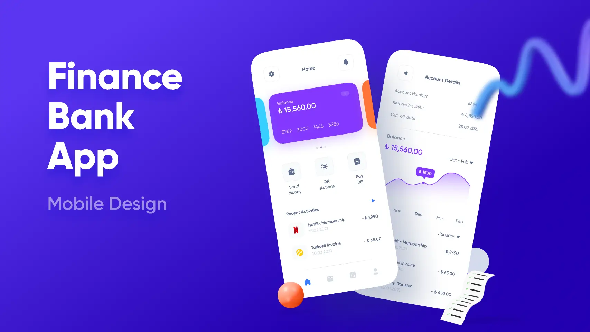

## Table of Contents
1. [Overview](#overview)
2. [Role](#role)
3. [Problem](#problem)
4. [Goal](#goal)
5. [Solution](#solution)
- [How do users manage finances currently?](#how-do-users-manage-finances-currently)
- [What features do users value most?](#what-features-do-users-value-most)
- [Exploring new financial management tools](#exploring-new-financial-management-tools)
- [User Journey](#user-journey)
6. [User Testing](#user-testing)
7. [Challenges and Learnings](#challenges-and-learnings)
8. [Final Thoughts](#final-thoughts)

---

## Overview
**BudgetWise** is a mobile application designed to help users manage their personal finances efficiently. Built using **React Native**, **Expo**, and **TypeScript**, it aims to provide a seamless experience for users to track expenses, set budgets, and visualize financial goals.

The app bridges the gap for individuals struggling to organize their financial habits by offering a modern and intuitive solution.

---

## 👨‍💻 Role
**Lead Developer** and **UI/UX Designer**

---

## ❓ Problem
Many individuals face difficulty in:
1. Tracking daily expenses consistently.
2. Setting realistic budgets and sticking to them.
3. Understanding their spending patterns due to lack of clear visualization tools.

---

## 🎯 Goal
1. Simplify the process of tracking expenses and setting budgets.
2. Empower users to make informed financial decisions with intuitive visualizations.
3. Increase user engagement by gamifying goal setting and achievement.

---

## ✨ Solution

### How do users manage finances currently?
We conducted a survey of 20 individuals and found:
- 65% use spreadsheets but find them time-consuming.
- 25% rely on physical notes or memory.
- 10% use financial apps but feel they are overly complicated.

### What features do users value most?
Survey participants ranked the following features as most important:
1. **Expense categorization.**
2. **Budget-setting tools.**
3. **Goal progress visualization.**

### Exploring new financial management tools
We designed a dashboard that combines:
1. **Categorized Expense Tracking:** Auto-categorizes based on transaction type.
2. **Budget Alerts:** Real-time notifications when nearing budget limits.
3. **Savings Gamification:** Rewards users for hitting their financial goals.

---

### User Journey
1. **Onboarding:** Users input financial goals and monthly income during sign-up.
2. **Expense Tracking:** Add expenses manually or sync with bank accounts.
3. **Budget Monitoring:** Dynamic dashboards display budget status.
4. **Goal Tracking:** Progress is visualized with charts and milestones.

---

## 🧪 User Testing
We tested the prototype with 12 participants and discovered:
- **Ease of Use:** 10/12 users appreciated the minimalist design.
- **Notifications:** 8/12 felt the alerts were helpful, but some found them intrusive.
- **Visualization:** All users loved the goal progress charts but suggested adding weekly summaries.

---

## ⚙️ Challenges and Learnings
1. **Real-Time Data Synchronization:** Ensuring seamless bank account integration while maintaining security was a technical hurdle.
2. **Balancing Notifications:** Finding the right frequency for alerts to avoid overwhelming users.
3. **Accessibility:** Testing with colorblind users led to revising the color scheme for better visibility.

---

## ✨ Final Thoughts
1. **Data Security is Paramount:** Financial data requires robust encryption and secure APIs for user trust.
2. **Iterative Design Works:** Continuous user feedback helped refine the app to meet real needs.
3. **User Education is Key:** Some users lacked basic financial literacy, so adding educational tips and videos enhanced their experience.

---
